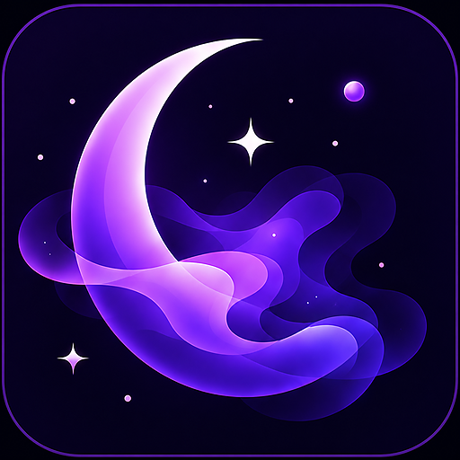
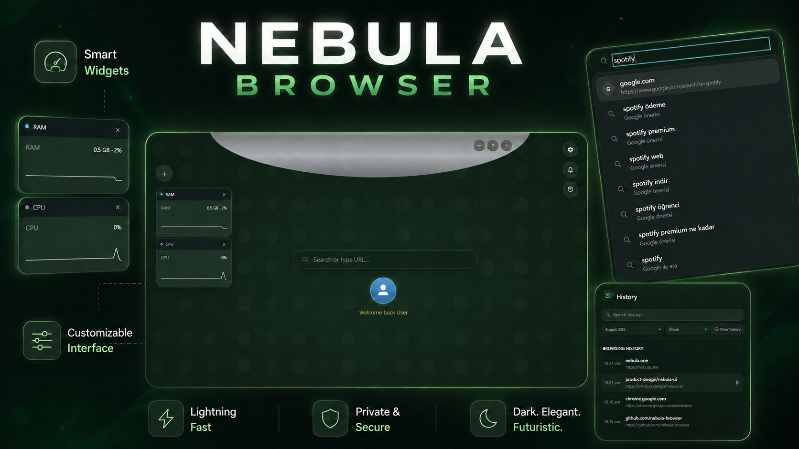

<div align="center">

<h1>
  
  Nebula Browser
</h1>

<h3>A browser that gets out of your way.</h3>

<p>
A Windows-first desktop browser built around a minimal, spatial interface instead of a traditional always-visible tab bar.
</p>

<p>
Built with <strong>Tauri 2</strong>, <strong>React 19</strong>, <strong>TypeScript</strong>, <strong>Rust</strong>, and <strong>Microsoft WebView2</strong>.
</p>

<a href="https://github.com/memirusta/Nebula-Browser/releases">
  
</a>
<a href="https://github.com/memirusta/Nebula-Browser/releases/latest">
  
</a>
<a href="https://tauri.app/">
  
</a>
<a href="https://react.dev/">
  
</a>

<br><br>

<a href="https://github.com/memirusta/Nebula-Browser/releases/latest"><strong>Download for Windows</strong></a>
&nbsp;·&nbsp;
<a href="https://drive.google.com/file/d/1D6d9yt8AardaDiC7bjiCk4MJkrXR0XYz/view?usp=sharing"><strong>Watch the demo</strong></a>

<br><br>

<a href="https://drive.google.com/file/d/1D6d9yt8AardaDiC7bjiCk4MJkrXR0XYz/view?usp=sharing">
  
</a>

</div>

---

## Meet Nebula

Most desktop browsers still revolve around the same layout: a permanent tab strip, a permanent address bar, and browser chrome that is always there whether you need it or not.

Nebula takes a different approach.

The interface stays out of the way while you browse and appears when you need it. Tabs, shortcuts, folders, previews, search, and navigation are brought together through the **Semi-Lunar interface** — a floating workspace designed to keep browsing fast without permanently filling the screen with controls.

> **Nebula does not try to redesign the web. It redesigns the space around it.**

---

## ✨ Highlights

### 🌙 Semi-Lunar Navigation

Nebula's signature interface replaces the traditional always-visible tab strip with a floating semi-lunar dock.

Use it to:

- switch between open tabs
- launch saved shortcuts
- organize shortcuts into folders
- preview pages before switching
- close tabs quickly
- jump back home
- access browsing actions without permanent browser chrome

The same Semi-Lunar interface is shared across Home, Browsing, and Overlay modes.

---

### 🔎 Smart Search

Nebula combines local browsing history with live search suggestions.

Supported search engines:

- Google
- DuckDuckGo
- Bing

Visited sites can appear alongside live autocomplete suggestions, giving the search bar both browser-history awareness and real-time search assistance.

---

### 🏠 A Home Screen That Is Actually Yours

Nebula's home screen is a workspace rather than a static new-tab page.

Customize:

- wallpapers
- pinned websites
- search placement and size
- profile placement
- RAM and CPU widgets
- clock appearance
- greeting
- glass, blur, and opacity
- accent colors
- Semi-Lunar size and animation behavior

Home modules can be repositioned without changing the browsing experience.

---

### 👁 Tab Previews

Hover over supported shortcuts and tabs to preview their current browsing session before switching.

It is especially useful when multiple pages are open but you do not want a permanent tab strip occupying screen space.

---

### 🗂 Folders

Drag shortcuts together to organize them directly inside the Semi-Lunar dock.

Folders support:

- multiple shortcuts
- renaming
- drag interactions
- individual item removal
- automatic cleanup when members are removed

---

### 📥 Downloads

Nebula includes an integrated download manager with:

- active download progress
- completed downloads
- browser notifications
- quick access from the toolbar

---

### 📜 History & Session Recovery

Browsing history is stored locally and integrated directly into Nebula.

Features include:

- recent browsing history
- recently closed tabs
- reopening closed tabs
- previous-session restoration
- crash recovery

---

### 🔐 Password Vault

Nebula includes a local password vault and a browser-side autofill bridge.

Saved credentials can be managed from Settings and used inside supported browsing sessions.

---

### 🛡 Privacy Controls

Nebula includes configurable privacy options for:

- tracking protection
- cookie restrictions
- HTTPS-only browsing
- Global Privacy Control
- clear-on-exit
- private mode
- permission policies
- site exceptions
- custom block lists
- cookie-banner blocking

Nebula also integrates **uBlock Origin** into its desktop browsing environment.

---

### 🔔 Notifications

Nebula has its own notification center for browser events such as downloads and supported site notifications.

---

### ⌨️ Keyboard Navigation

Common browser workflows are available from the keyboard, including:

- new, close, and reopen tab
- next / previous tab
- direct tab switching
- back / forward
- reload
- focus search
- zoom controls
- Home
- F12 — Nebula Inspector

Shortcut mappings can be viewed and configured from Settings.

---

### 🧩 Native Site UI

Nebula replaces many default WebView2 browser surfaces with its own interface.

This includes:

- JavaScript alerts, confirms, and prompts
- site permission requests
- HTTP authentication prompts
- context menus
- new-window handling
- integrated site notifications

WebView2 remains the rendering engine while Nebula owns the visible browser experience.

---

### 🛠 Nebula Inspector

Press **F12** to open Nebula's built-in browser inspector.

It includes:

- DOM and element inspection
- computed styles
- JavaScript console and evaluation
- performance and memory metrics
- local and session storage inspection
- cookie and site information
- permission and security diagnostics

The inspector is built directly into Nebula rather than relying on the standard WebView2 DevTools interface.

---

## 🎬 Demo

Watch the full Nebula Browser showcase:

**[▶ Open the demo video](https://drive.google.com/file/d/1D6d9yt8AardaDiC7bjiCk4MJkrXR0XYz/view?usp=sharing)**

---

## 🧠 How Nebula Works

Nebula is built with:

| Layer | Technology |
| --- | --- |
| Desktop shell | Tauri 2 |
| Native backend | Rust |
| Interface | React 19 + TypeScript |
| Bundler | Vite |
| Windows rendering | Microsoft WebView2 |
| Windows installer | NSIS |

Unlike a conventional single-WebView Tauri application, Nebula uses multiple native WebViews on Windows.

### Windows WebView architecture

```text
┌─────────────────────────────────────────────┐
│                  Window                     │
│                                             │
│  nebula-chrome              top overlay     │
│  ─────────────────────────────────────────  │
│       bounded Semi-Lunar browser UI         │
│                                             │
│  nebula-tab-*               middle layer    │
│  ─────────────────────────────────────────  │
│       full-client website WebViews          │
│                                             │
│  main                       bottom layer     │
│  ─────────────────────────────────────────  │
│       Home / app UI / modal surfaces        │
│                                             │
└─────────────────────────────────────────────┘
```

Each open browser tab can use its own native WebView. The Home surface stays mounted underneath browsing content, while the dedicated Semi-Lunar WebView is physically bounded to its floating overlay instead of reserving layout space above the page.

Nebula dynamically manages visibility and native z-order so these surfaces behave like one application without pushing website content down.

---

## 📁 Project Structure

```text
src/
├── components/
│   ├── BrowserShell/
│   ├── HomeCenter/
│   ├── SemiLunarMenu/
│   ├── SettingsPanel/
│   ├── DownloadManager/
│   ├── HistoryPanel/
│   ├── NotificationPanel/
│   └── ...
│
├── core/
│   ├── browser state
│   ├── settings
│   ├── shortcuts
│   ├── history
│   └── bridge logic
│
├── hooks/
│   └── React state + browser integrations
│
├── platform/
│   └── Tauri / native WebView bridge
│
└── ChromeApp.tsx

src-tauri/
├── src/
│   └── Rust native browser commands
├── capabilities/
├── permissions/
└── tauri.conf.json
```

---

## 🚀 Installation

### Windows

Download the latest installer from:

**[GitHub Releases](https://github.com/memirusta/Nebula-Browser/releases/latest)**

Nebula currently targets Windows as its primary supported platform.

Microsoft WebView2 is required and is already available on most modern Windows 10 and Windows 11 installations.

---

## 🛠 Development

### Requirements

You will need:

- Node.js
- npm
- Rust
- Microsoft WebView2 Runtime
- Tauri prerequisites for Windows

Clone the repository:

```bash
git clone https://github.com/memirusta/Nebula-Browser.git
cd Nebula-Browser
npm install
```

Run the desktop browser:

```bash
npm run tauri dev
```

### Web-only UI development

The React interface can also be started without the native browser layer:

```bash
npm run dev
```

Some functionality — including native browser tabs, system statistics, native browsing behavior, and WebView integrations — requires the Tauri application.

---

## 📦 Building

### Windows x64

```bash
npm run tauri:build:x64
```

### Windows x86

```bash
npm run tauri:build:x86
```

### Native binary without installer

```bash
npm run tauri:build:binary
```

Installer bundles are generated using NSIS.

---

## 🧪 Testing

Nebula includes smoke, native, clean-install, and release checks.

```bash
npm run test:e2e
npm run test:native-smoke
npm run test:release-smoke
npm run release:preflight
```

Additional Windows install tests are available through the clean-install, upgrade-install, and Windows Sandbox scripts in `scripts/`.

---

## ⚠️ Current Platform Status

Nebula is currently **Windows-first**.

Its desktop architecture relies heavily on native multi-WebView behavior and Windows-specific WebView2 integration.

The React interface is designed to remain portable, but full native browser-window behavior on macOS and Linux is not yet at feature parity with Windows.

---

## 🗺 Roadmap

Nebula is actively evolving. Areas for continued work include:

- browser compatibility improvements
- performance and memory optimization
- expanded privacy tooling
- additional platform support
- continued Semi-Lunar interaction improvements
- further polish around native browser behavior

---

## ❤️ Why Nebula?

Nebula started from a simple question:

### What if the browser UI disappeared until you actually needed it?

Instead of making another variation of the traditional browser layout, Nebula experiments with a spatial interface where navigation appears around your workflow rather than permanently occupying part of the screen.

That experiment has grown into a browser you can actually use.

---

## Code signing policy

Free code signing provided by [SignPath.io](https://signpath.io/),
certificate by [SignPath Foundation](https://signpath.org/).

See [CODE_SIGNING.md](CODE_SIGNING.md) for Nebula's code signing policy
and [PRIVACY.md](PRIVACY.md) for its privacy policy.

---

## License

Nebula is free and open-source software licensed under the **GNU General Public License v3.0 only (GPL-3.0-only)**.

You are free to use, study, modify, fork, and redistribute Nebula under the terms of the GPL.

Modified versions must remain under the GPL when distributed and must preserve the notices required by the license.

The **Nebula** name, logo, and project branding are handled separately from the source-code license. Community forks are welcome, but modified distributions must not present themselves as official Nebula releases.

See [LICENSE](LICENSE) for the software license and [TRADEMARKS.md](TRADEMARKS.md) for the name and brand policy.

Third-party components included with Nebula remain subject to their respective licenses.

---

<div align="center">

### Nebula Browser

**Browse the web. Keep the space.**

Made with Tauri, Rust, React, and an unreasonable amount of glass.

</div>
